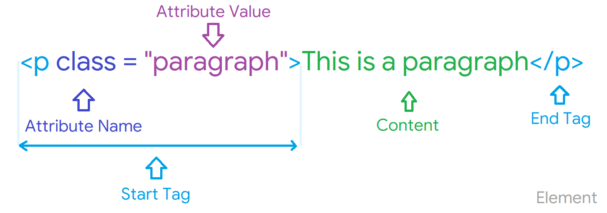

# `HTML`

### `Hyper Text Markup Language`

```html
<!DOCTYPE html> 
<html>
 
   <head> 
      <title>Align Attribute  Example</title> 
   </head>
	
   <body> 
      <p align = "left">This is left aligned</p> 
      <p align = "center">This is center aligned</p> 
      <p align = "right">This is right aligned</p> 
   </body>
	
</html>
```



### `HTML Element` : `Start Tag` + `Content` + `End Tag`

### What are HTML `Tags` ?
- Primary component of the HTML enclosed within angle braces `<>`

### What are `Attribute` ?
- Define the characteristics of an HTML Element (Case Sensitive)

```html
<p align = "left">This is a content</p> 

Here 👆🏻 
<p> : Paragraph Starting Tag.
align : Attribute that define the characteristic for content. 
left : Value of an attribute.	
content : Text to be displayed on website.	
</p> : Paragraph End Tag.	
```

### What are HTML `Void Elements` ?  
- HTML Elements which do not have closing tags e.g. ``, `<br>`, `<hr>`, etc.

### What are `HTML Entities` ?  
- Reserved Characters like `<`, `>`, `\`, etc
- To use this characters on web pages we need to use HMTL Entities.

Character | Entity Name
:--- | :---
`<` | `&lt;`
`>` | `&gt;`
`&` | `&amp;`
non breaking space e.g 10 PM | `&nbsp;`

### What is the `class attribute` in HTML?
- Class attribute is used to specify class name for an HTML Element.
- Multiple elements in HTML can have same class value.
- We can use `id` attribute to create difference between same class values.

```html>
<p class = "row"></p>
```

### Describe HTML `layout structure`
- Web page has different components to display the intended content.
- `<header` : Display header information of the web page (Top)
- `<footer` : Display footer of the web page (Bottom)
- `<nav>` : Navigation menu of HTML page.
- `<article>` : Set of information.
- `<section>` : Used inside article block to define basic structure of a page.
- `<aside>` : Sidebar content of page.

### HTML `Formatting tags`
- <b/> - `bold` text
- <i/> - `italic` text
- <em> - `italic` text with added semantics importance 
- <big> - increases the font size of the text by one unit
- <small> - decreases the font size of the text by one unit
- <sub> - `subscript` text
- <sup> - `superscript` text
- <del> - `strikeout` text
- <strong> - `bold` important text
- <mark> - `highlight` text
	
### `<head>` and `<body>` tag in HTML
	
<ins> - displays as added text
