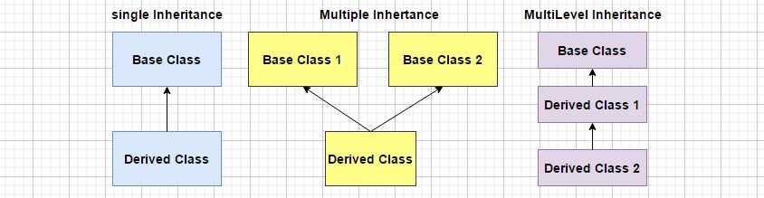

### Object Oriented Programming Concepts

<table>
  <tr>
    <th align=left><a href= "#class">1. Class</a></th>
    <th align=left><a href= "#int">2. Interface</a></th>
    <th align=left><a href= "#obj">3. Object</a></th>
    <th align=left><a href= "#abs">4. Abstraction</a></th>
    <th align=left><a href= "#enc">5. Encapsulation</a></th>
    <th align=left><a href= "#poly">6. Polymorphism</a></th>
    <th align=left><a href= "#inh">7. Inheritance</a></th>
  </tr>
</table>

<h3 name='class'>1. Class</h3>

- `Blueprint` or `template` that describes 👇🏻
- `Attributes` ( Properties ) and `Method` ( Behavior | Action ) of an object.

```C#
public class Student  
 {  
     int id; 
     String name; 
 }  
```

<h3 name='int'>2. Interface</h3>

- `Blueprint` of a `class`.
- Methods declared inside the interface are `abstract` methods.
- Used to achieve `multiple` inheritance.

```C#
using System;  

public interface Draw
{  
    void draw();  
}  

public class Rectangle : Draw  
{  
    public void draw()  
    {  
        Console.WriteLine("Drawing Rectangle...");  
    }  
}  

public class Circle : Draw
{  
    public void draw()  
    {  
        Console.WriteLine("Drawing Circle...");  
    }  
}  

public class TestInterface  
{  
    public static void Main()  
    {  
        Draw d;  
        d = new Rectangle();  
        d.draw();  
        d = new Circle();  
        d.draw();  
    }  
}  
```

```C#
Output :
Drawing Rectangle...
Drawing Circle...
```

<h3 name='obj'>3. Object</h3> 

- `Instance` of class which has `attributes` and `methods`.

```C#
Student s1 = new Student();
```

- e.g. 
- `Person` is a `class` 
- `Dia` is an `instance` of class `person`
- `Property` : Dia has some `attributes` ( Height, Weight, Color, Gender )    
- `Method` : `Behavior` and `actions` of Dia ( Talk, Run, Play, Fight, Sing, Cry )

<h3 name='abs'>4. Abstraction</h3>

- `Show` only important information and `hide` unnecessary details from users.
- e.g. Mobile can do many things like make a call, take pictures, play games, watch movies, etc.
- It doesn't show the inside process of how its doing the things (Implementation parts are hidden)

<h3 name='enc'>5. Encapsulation</h3> 

- Bind together the `data`, `attributes` and `methods` ( Class = Data + Attribute + Method )
- e.g. A company has several departments Production, HR, Accounts, Marketing.
- All these departments makes up a company, and each department has it's own purpose and actions.
- `Class` : Car
- `Properties` : ( Physical Attributes of Car | Color, Type, Size, Name, Model )
- `Method` : ( Action Performed by the Car | Use of Car | Drive | Stop )

<h3 name='poly'>6. Polymorphism (Many Forms)</h3>

- Having more than one form.
- Allow to call methods of base class in derived class.
- e.g A person at same time is a father, a husband, an employee and behaves accordingly.

#### a. `Method Overriding`
- `Derived Class` can `inherit` and `override` | Modify the `attributes` and `methods` of it's `Base Class`

#### b. `Method Overloading`
- Creating multiple methods with `same name` but with different ( `unique` ) parameters | attributes.

#### c. `Operator Overloading`
- Same operator behaves different with different data types according to context.
- ( + Operator ) performs `arithmetic` operations between `numbers` but performs `concatenation` between `strings`.

<h3 name='inh'>7. Inheritance</h3> 

- The process in which one class inherit the `attribute` and `method` of another class.
- e.g `Child` inherits properties and behaviours from `mom` and `dad`.
- e.g Dogs can have same color, same name, same size and same breed, but they are not same.

### `Similar` Words

- `Parent` Class = `Base` Class = `Super` Class
- `Child` Class = `Derived` Class = `Sub` Class



#### 1. `Single Inheritance`
- Class `B` inherit from class `A` | New class is derived from base class.
- e.g. `Boy` inherit `father` properties and behaviours.

#### 2. `Multiple Inheritance`
- Class `A` inherit from class `B` and class `C` | A class can be derived from more than one base class.
- e.g. Class truck, class car, class bus inherit from class vehicle.

#### 3. `Multilevel Inheritance`
- Class `C` inherit from class `B` and class `B` inherit from class `A`
- e.g. `Boy` inherit from `father` and `father` inherit from `grand father`.

### Programming Constructs

- Common building blocks to construct any program.


1. `Sequence` : Step by step process ( Follow only one direction : Top to bottom)
2. `Selection` : Steps taken based on conditions ( If Else or True False Condition )
3. `Iterations` : Repeated process which can change the step based on certain conditions.
